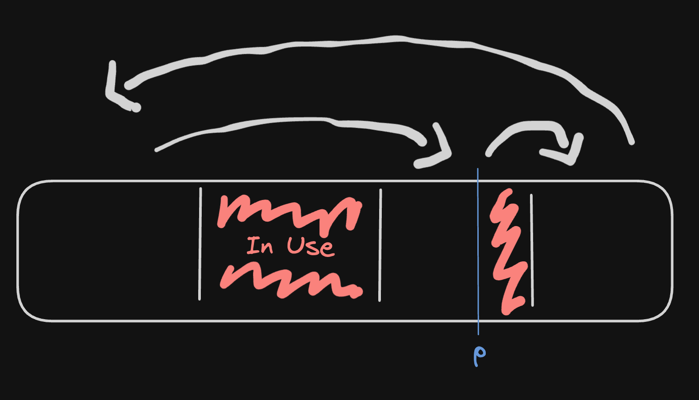
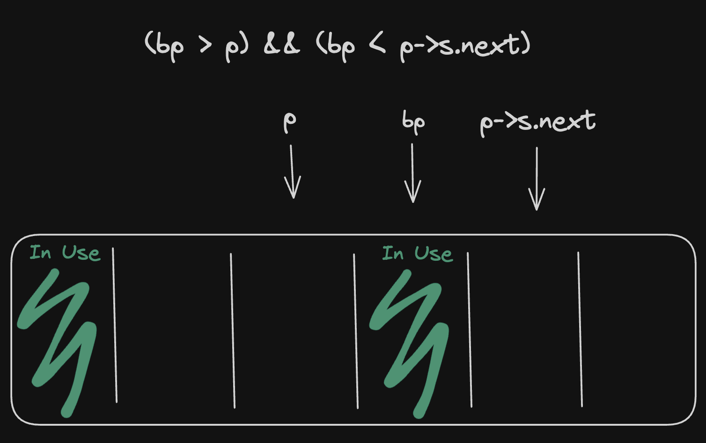

In C, dynamic memory is manually managed, meaning that it is up to the programmer to properly allocate memory, and freeing it when done. Memory is allocated using `malloc()` function, and freed with `free()`. You can read more about it [here](https://linux.die.net/man/3/malloc). The API is pretty simple, and there's not much to talk about on the surface. Let's see how it is implemented.

## Goals of malloc()
In most operating systems today, everytime you run a program, the kernel abstracts away the memory the program uses into virtual memory. The [virtual memory](https://en.wikipedia.org/wiki/Virtual_memory) is completely separate from the physical memory, meaning it has its own memory addresses, size, etc. Every program has a fixed amount of memory when it starts, and has to [call](https://en.wikipedia.org/wiki/System_call) upon the kernel to request more memory. The problem is, every operating system has its own way of requesting memory from the kernel. The primary goal of malloc and free API abstracting away all of this away from the programmer.

Another goal of malloc is performance. System calls are expensive, and so a common goal among all allocators is reducing the amount of requests for memory as much as possible. Usually, this is achieved by requesting huge chunks of memory from kernel to be shared with subsequent malloc calls, and recycling freed memory. This however, introduces its own set of problems, such as [fragmentation](https://en.wikipedia.org/wiki/Fragmentation_(computing)). We'll have to account for that as well.


## Implementing malloc() and free()
Now that we know why we are implementing malloc, let's implement it. Now, there are many things to consider when implementing the API: performance, security, implementation overhead, etc. As a result, there are *many* different implementations of malloc, each with their own advantages and tradeoffs. For the purpose learning, I will demonstrate a very simple implementation, which can be found in [K&R](https://en.wikipedia.org/wiki/The_C_Programming_Language) book.

As said in the above section, we want to reduce of system calls for more memory as much as possible. Therefore, we're going to always request at least 1096 bytes from the system, and split it among subsequent malloc calls.
``` C
#define NALLOC 1024
```

As a result, we need a way to keep track of all free blocks that can be given to the caller. We can simply create a cyclic linked list of free blocks, like this. 

We also need some some metadata, to keep track of the size of the free blocks that can be given to the caller. 
``` C
typedef long Align;     /* for alignment to long boundary */

typedef union header {  /* block header */
    struct {
        union header *next;  /* next block on free list */
        unsigned size;      /* size of this block */
    } s;
    Align x; /* force alignment of block */
} Header;
```
This looks a little weird, but this will act as the header for the block, containing information related to the block. The union and the `Align` field is simply for forcing each header to be aligned, in case if the size of the struct is improperly aligned (note: I'm not sure if modern C requires this). 

Now we can start implementing `malloc`. The `base` is where we'll store all the free blocks, and the search for a free block will start at `freep`. If there's no big-enough block, `morecore()` requests the kernel for more memory, and inserts a new block to `base`. If a block is bigger than the requested the size, the block is split, and the tail end of the block is given to the caller. 


``` C
static Header base = {0};       /* list of free blocks */
static Header *freep = NULL;    /* pointer to last free block searched*/

void *malloc(size_t n) {
    /* round up to the proper amount of header-sized units */
    size_t nunits = ((n + sizeof(Header) - 1) / sizeof(Header)) + 1;
    Header *prevp = freep;

    if (freep == NULL) { /* no free list yet */
        base.s.next = freep = prevp = &base;
        base.s.size = 0;
    }

    /* find big enough page */
    for (Header *p = prevp->s.next; ;prevp = p, p = p->s.next) {
        if(p->s.size >= nunits) {   /* big enough page found */
            if (p->s.size == nunits)    /* exact size */
                prevp->s.next = p->s.next;
            else {              /* allocate tail end */
                p->s.size -= nunits;
                p += p->s.size;
                p->s.size = nunits;
            }

            freep = prevp;
            /* increment pointer to the 
             * first address after the header, 
             * and cast as void */
            return (void *)(p+1); 
        }
        if (p == freep) { /* wrapped back. Need to expand heap */
            p = morecore(nunits);
            if (p == NULL)
                return NULL;
        }
    }
}
```

Next we'll implement `free`. It scans the list, starting at `freep`, and looks for a place to insert the block. This will be either between two existing blocks, or at the start or end of the list. 



Next, we'll check if the block neighbors existing free blocks, and if so, the neighboring block will be coalesced.
``` C
void free(void *ap) {
    Header *bp = (Header *)ap - 1; /* pointer to block header */

    Header *p = freep;
    /**
     * iterate until we find two blocks, such that
     * the address of bp is between the addresses
     * of the two blocks.
    **/
    for (; !((bp > p) && (bp < p->s.next)); p = p->s.next)
        if (p >= p->s.next && (bp > p || bp < p->s.next))
            break; /* freed block at start or end of list */

    if (bp + bp->s.size == p->s.next) { /* join to upper nbr */
        bp->s.size += p->s.next->s.size;
        bp->s.next = p->s.next->s.next;
    } else
        bp->s.next = p->s.next;
    if (p + p->s.size == bp) {          /* join to lower nbr */
        p->s.size += bp->s.size;
        p->s.next = bp->s.next;
    } else
        p->s.next = bp;

    freep = p;
}
```

Now we're almost done! The final thing to implement is `morecore`. It asks the system for memory, and return it as a Header block. As said above, we want to try to reduce the amount of calls to `sbrk` as possible, so `morecore` will always request for >1024 Header units of memory. `free` is used to insert the block into the list of free blocks.
``` C
/* Request block of memory */
static Header *morecore(size_t nu) {
    if (nu < NALLOC)
        nu = NALLOC;

    void *cp = sbrk(nu * sizeof(Header));
    if (cp == (void *) -1)
        return NULL;
    Header *up = (Header *)cp;
    up->s.size = nu;
    free((void *)(up + 1)); /* put it into the list of free blocks */

    return freep;
}
```

Full code example [here](https://github.com/yanghuaxuan/smalloc/tree/97d6216ffd163014bbcf012c211adb639ca672bf)

## Conclusion
K&R malloc is really elegant, and I enjoyed every my time understanding how it works. Unfortunately, it suffers from many problems. For instance, the performance is not really good, with malloc() and free() both having to take O(n) time if needed. Regardless, it is fully working memory allocator which solves common problems such as freed memory recycling, and fragmentation in under 100 lines of code! Many allocators in use today are much faster, but have to deal with issues such as memory alignment, multi-threading, CPU cache locality, etc. in order to achieve good performance, which significantly increases complexity. 

If you found this interesting, and would like to further research memory allocators, considering looking into [dlmalloc](https://gee.cs.oswego.edu/dl/html/malloc.html), a very popular and influential memory allocator. It has extensive books and articles written about to its internals, such as this article [here](http://www.phrack.org/issues/57/8.html). It is still the allocator of choice for GNU/Linux, albeit with minor additions to increase its multi-threading performance. Another allocator worth looking into is Microsoft's [mimalloc](https://github.com/microsoft/mimalloc), which claims to be faster (and simpler) than all modern allocators in use today.

# Resources
- [Lecture notes on dynamic memory](https://www.cs.princeton.edu/courses/archive/fall12/cos217/lectures/21DynamicMemory2.pdf)
